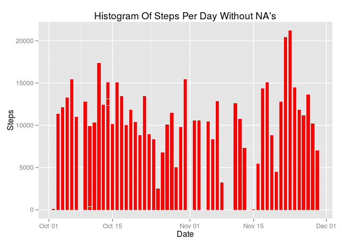
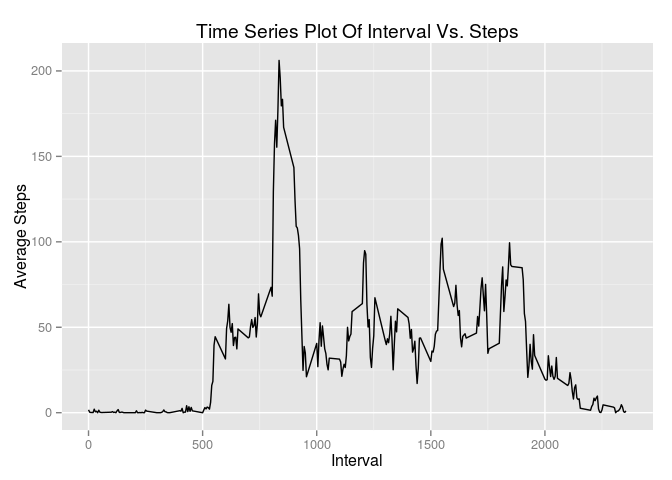
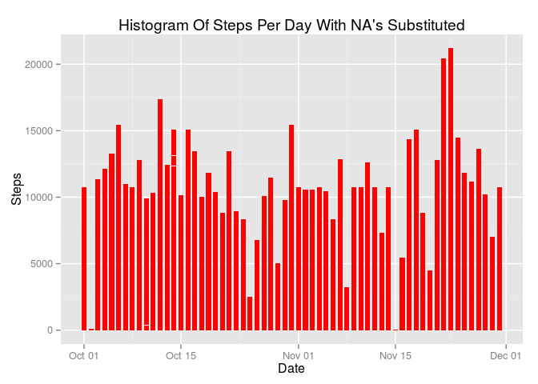
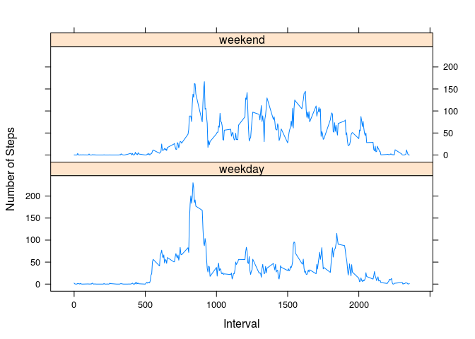

# Reproducible Research: Peer Assessment 1

Tina Wilkerson

## Loading and preprocessing the data

```r
library(plyr)
library(ggplot2)
library(lattice)

file <- "activity.csv"
data <- read.csv(file)

data.nona <- na.omit(data)
```

## What is the mean total number of steps taken per day?


```r
data.nona$date <- as.Date(data.nona$date, format="%Y-%m-%d")
g <- ggplot(data.nona, aes(date, steps)) 
g <- g + geom_bar(stat = "identity", fill = "red", width = 0.7)
g <- g + labs(title="Histogram Of Steps Per Day Without NA's", x="Date", y="Steps")
print(g)
```

 

We can calculate the mean and median of the number of steps taken per day:

```r
sum.steps <- aggregate(data.nona$steps, list(date = data.nona$date), FUN="sum")
names(sum.steps)[2] <- "steps"
head(sum.steps, 3)
```

```
##         date steps
## 1 2012-10-02   126
## 2 2012-10-03 11352
## 3 2012-10-04 12116
```

```r
mean(sum.steps$steps)
```

```
## [1] 10766.19
```

```r
median(sum.steps$steps)
```

```
## [1] 10765
```

## What is the average daily activity pattern?


```r
avg.steps <- aggregate(data.nona$steps, list(interval = as.numeric(as.character(
                    data.nona$interval))), FUN = "mean")
names(avg.steps)[2] <- "steps"
head(avg.steps, 3)
```

```
##   interval     steps
## 1        0 1.7169811
## 2        5 0.3396226
## 3       10 0.1320755
```

```r
g <- ggplot(avg.steps, aes(interval, steps))
g <- g + geom_line()
g <- g + labs(title="Time Series Plot Of Interval Vs. Steps", x="Interval", y="Average Steps")
print(g)
```

 

We can calculate the 5-minute interval with the maximum number of steps:

```r
avg.steps[avg.steps$steps == max(avg.steps$steps), ]
```

```
##     interval    steps
## 104      835 206.1698
```

## Imputing missing values

The total number of rows with missing values can be calculated as follows:

```r
nrow(data[is.na(data[1:nrow(data), ]), ])
```

```
## [1] 2304
```

We can substitute the missing values with the mean of the steps for the current interval:

```r
head(data, 3)
```

```
##   steps       date interval
## 1    NA 2012-10-01        0
## 2    NA 2012-10-01        5
## 3    NA 2012-10-01       10
```

```r
data.sub <- data
for(i in 1:nrow(data.sub)){
    if(is.na(data.sub$steps[i])){
        data.sub$steps[i] <- avg.steps[which(data.sub$interval[i] == 
                                                 avg.steps$interval), ]$steps
    }
}

head(data.sub, 3)
```

```
##       steps       date interval
## 1 1.7169811 2012-10-01        0
## 2 0.3396226 2012-10-01        5
## 3 0.1320755 2012-10-01       10
```

Then plot the original histogram using the new values:

```r
data.sub$date <- as.Date(data.sub$date, format="%Y-%m-%d")
g <- ggplot(data.sub, aes(date, steps)) 
g <- g + geom_bar(stat = "identity", fill = "red", width = 0.7)
g <- g + labs(title="Histogram Of Steps Per Day With NA's Substituted", x="Date", y="Steps")
print(g)
```

 

By using the new data to recalculate the mean and median of steps per day we get:

```r
sum.steps.sub <- aggregate(data.sub$steps, list(date = data.sub$date), FUN="sum")
names(sum.steps.sub)[2] <- "steps"
mean(sum.steps.sub$steps)
```

```
## [1] 10766.19
```

```r
median(sum.steps.sub$steps)
```

```
## [1] 10766.19
```

While the mean seems to stay the same between missing values and substitued values, the median does change slightly, going from 10765 to 10766. This does not appear to be a drastic change, however any changes in outcomes should be taken into consideration.

## Are there differences in activity patterns between weekdays and weekends?

We can add another column to our data.sub to distinguish between weekdays and weekends:

```r
data.sub$weekdays <- factor(weekdays(data.sub$date, abbreviate=FALSE))
levels(data.sub$weekdays) <- list(weekday=c("Monday", "Tuesday", "Wednesday", "Thursday",
                                            "Friday"), weekend=c("Saturday", "Sunday"))
levels(data.sub$weekdays)
```

```
## [1] "weekday" "weekend"
```

```r
table(data.sub$weekdays)
```

```
## 
## weekday weekend 
##   12960    4608
```

Then we can plot the average steps per interval based on the weekday or weekend:

```r
avg.steps.sub <- aggregate(data.sub$steps, list(interval = as.numeric(as.character(
                    data.sub$interval)), days = data.sub$weekdays), FUN = "mean")
names(avg.steps.sub)[3] <- "steps"
xyplot(avg.steps.sub$steps ~ avg.steps.sub$interval | avg.steps.sub$days, type="l", 
                    layout=c(1,2), xlab="Interval", ylab="Number of Steps")
```

 
